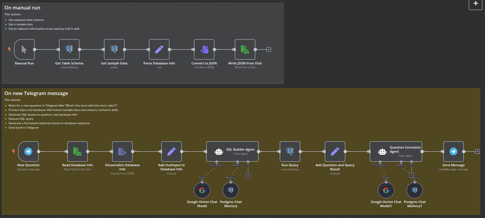

# Sales AI Agent

This workflow was created in n8n to listen for questions in Telegram about data in a Postgres table containing
information about sales and answer back. Two AI agents were used:
* the first generate SQL queries based on a question, in natural language, and database info, like sample data and schema;
* the second one gets the Postgres output and, based on the question, formulates a structured response.

